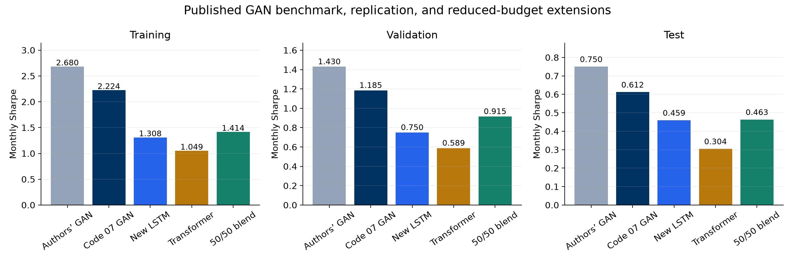
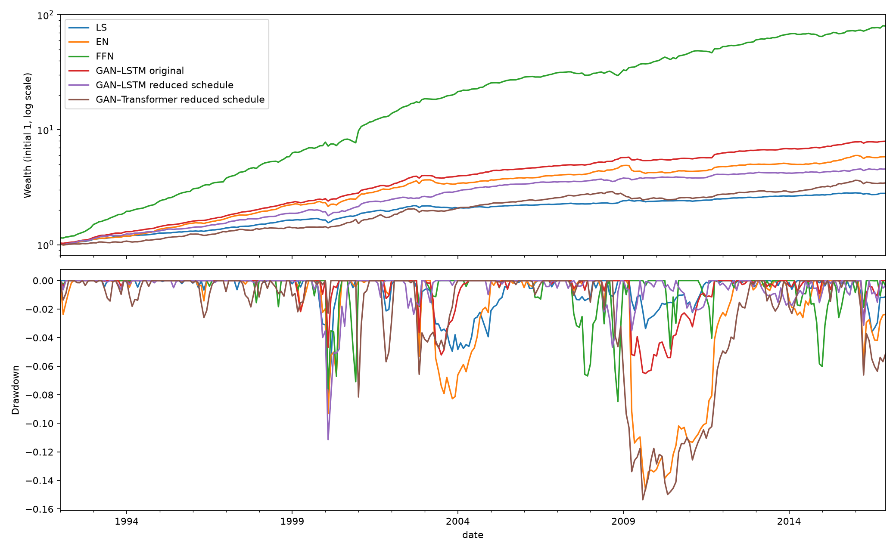
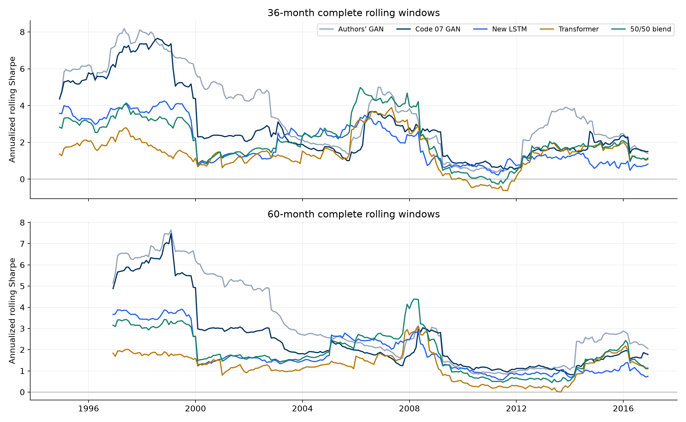
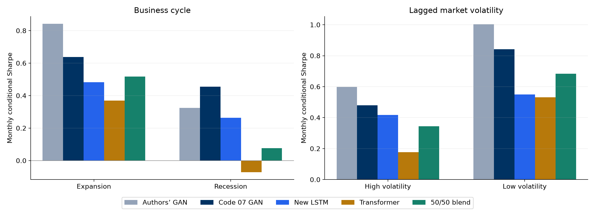
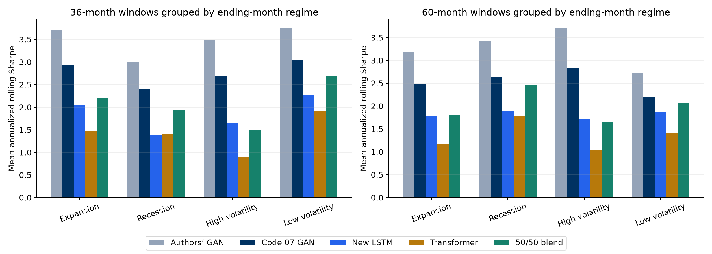
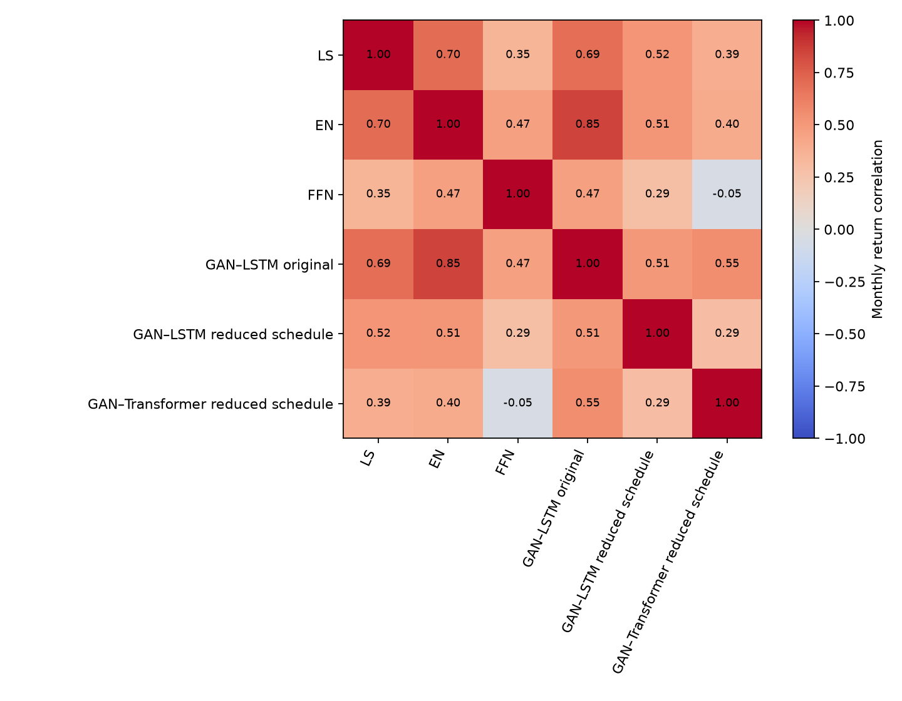
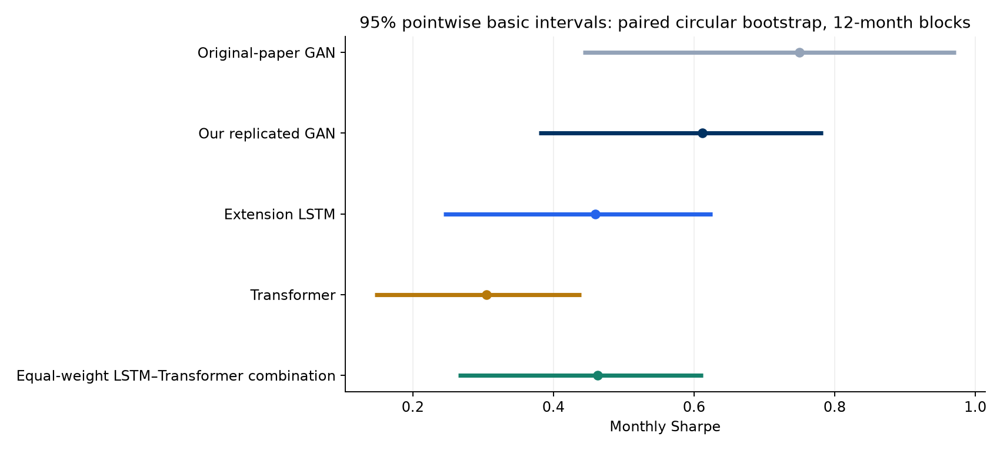
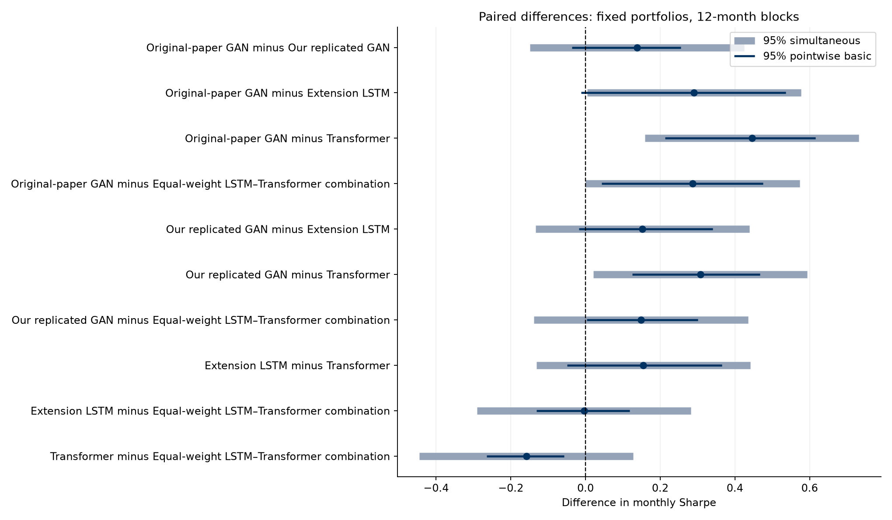
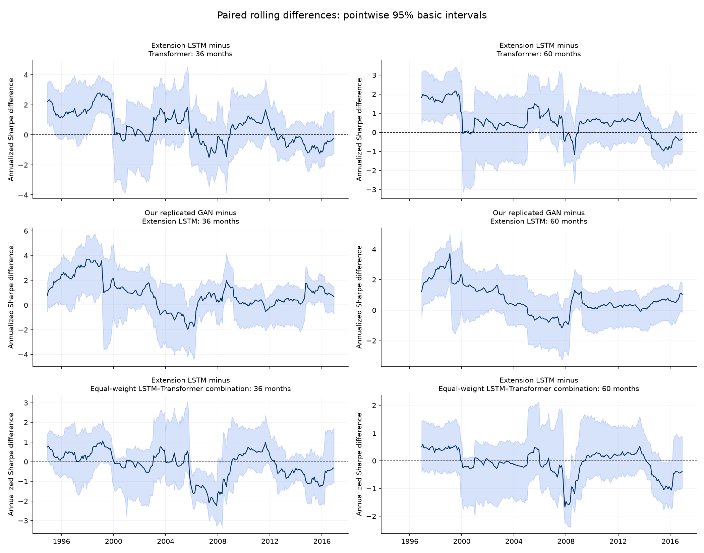
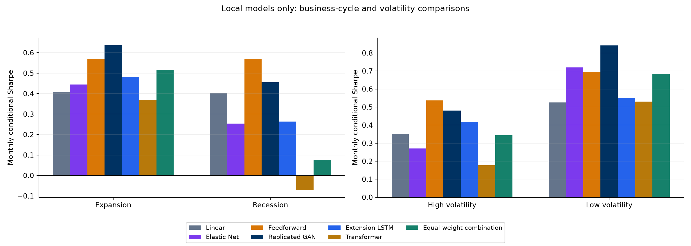

# Asset Pricing with Deep Learning: Replication, Extensions and Uncertainty

An academic study of how economic pricing restrictions, macroeconomic sequence models, and adversarial learning shape portfolio performance. We reproduce the original framework, compare our results with the authors, and extend the analysis to **LSTM versus Transformer, rolling windows, economic regimes, portfolio combinations, and bootstrap uncertainty**. The completed extension evidence comes from a reduced training schedule. Codes 09–012 reuse saved returns without retraining.

## Team and course

| Role | Name |
|---|---|
| Team member | Reza Zamani |
| Team member | Hrafnhildur Lif Jonsdottir |
| Team member | Paraj Goyal |
| Team member | Elouan Bahri |
| Professor | Ali Kakhbod |

**Group 7, UC Berkeley, Master of Financial Engineering.**

## Presentations and research draft

This README combines the original-paper presentation, our replication, the Codes 08–11 deck, and the updated Codes 08–012 presentations. The earlier files remain available for comparison.

| Presentation | Coverage | Files |
|---|---|---|
| 1. Original paper | Economic motivation, SDF, LSTM/FFN/adversarial architecture, published findings, critical assessment, and suggested improvements | [PowerPoint](presentation/01_Original_Paper.pptx) |
| 2. Our replication | Data reconstruction, benchmark methods, Codes 01–07, paper comparisons, rankings, validation checks, and implementation challenges | [PowerPoint](presentation/02_Our_Replication.pptx) |
| 3. Replication and extensions | Paper recap followed by Codes 08–11: architecture, seeds, rolling performance, regimes, risk, and combinations | [PowerPoint](presentation/03_Combined_Replication_and_Extensions_08_11.pptx), [PDF](presentation/03_Combined_Replication_and_Extensions_08_11.pdf) |
| 4. Updated research presentation | Original paper, replication, Codes 08–012, bootstrap methods, rolling uncertainty, local-model comparisons, and original Code 012 figures | [PowerPoint](presentation/04_Asset_Pricing_Replication_Extensions_and_Uncertainty.pptx), [PDF](presentation/04_Asset_Pricing_Replication_Extensions_and_Uncertainty.pdf) |
| 5. Detailed sectioned presentation | Eight numbered parts, two main-paper slides, two replication slides, four extension sections, combined comparisons, and summary | [PowerPoint](presentation/05_Asset_Pricing_Replication_and_Extensions.pptx), [PDF](presentation/05_Asset_Pricing_Replication_and_Extensions.pdf) |
| 6. 15-minute presentation (latest) | 20 slides covering all eight parts, key Code 012 figures, combined results, and speaker notes timed for 15 minutes | [PowerPoint](presentation/06_Deep_Learning_Asset_Pricing_15_Minutes.pptx), [PDF](presentation/06_Deep_Learning_Asset_Pricing_15_Minutes.pdf) |

The third deck contains 30 slides: 10 summarize previous work and 20 cover the extensions. The updated fourth deck contains 39 slides and retains the team names and Professor Ali Kakhbod. The detailed fifth deck is titled **Asset Pricing with Deep Learning: Replication and Extensions**. It contains 38 slides organized as follows:

| Part | Topic | Slides |
|---|---|---|
| 1 | Main paper | 3–4 |
| 2 | Replication | 5–6 |
| 3 | Transformer | 7–12 |
| 4 | Rolling windows | 13–17 |
| 5 | Regime change | 18–22 |
| 6 | Uncertainty | 23–30 |
| 7 | Combination and combined results | 31–37 |
| 8 | Summary | 38 |

The new 20-slide talk is titled **Deep Learning in Asset Pricing: Replication and Model Comparisons**. It retains two main-paper slides and two replication slides. Sections cover Transformer (7–8), rolling windows (9–11), regimes (12–13), uncertainty (14–16), combination (17–19), and summary (20). Suggested times in the PowerPoint speaker notes total 15 minutes. The previous detailed PowerPoint and PDF remain unchanged in `presentation/`.

In the detailed fifth deck, the extension sections begin with their own title slides, and slide titles and footers identify the current part. The research draft is available as [LaTeX source](paper/asset_pricing_extensions_draft.tex).

## Purpose and research questions

The original question is whether a model trained to satisfy asset-pricing restrictions can learn a useful stochastic discount factor from firm characteristics and macroeconomic history. Our project first checks the replication, then examines how changing the sequence architecture affects performance across time and economic conditions.

| Question | Approach | Evidence |
|---|---|---|
| Can we reproduce the original model rankings and portfolio performance? | Reconstruct the data pipeline and estimate linear, penalized, feedforward, and adversarial models | Codes 01–07, published Table I, Fama–French checks, author-factor correlation |
| Does Transformer improve on LSTM at a shared training budget? | Replace both macro encoders, retain common economic outputs and training conventions, and train nine seeds per architecture | Code 08, split Sharpe and seed diagnostics |
| Does one full-test Sharpe conceal changes over time? | Evaluate fixed saved models over complete 36- and 60-month windows | Code 09, rolling Sharpe, volatility, correlations, and drawdowns |
| Where do models perform differently? | Partition test months by business cycle and lagged market volatility | Code 10, conditional return/risk and Sharpe |
| How do architecture, rolling windows, and regimes interact? | Group rolling windows by their ending-month regime and compare all portfolios | Code 11, endpoint-regime tables |
| Does combining the architectures help? | Average saved LSTM and Transformer portfolio returns with fixed equal weights | Code 11, split, regime, and rolling combination comparisons |
| How precisely do we estimate the Sharpe differences? | Paired circular block bootstrap, multiple interval methods, dependence sensitivity and simultaneous pair comparisons | Code 012, full-test and rolling uncertainty, with additional comparisons among all seven local portfolios |

## Original paper: economic foundation

**Luyang Chen, Markus Pelger, and Jason Zhu, “Deep Learning in Asset Pricing.”** Published in *Management Science*, 70(2), 714–750. [Paper](https://arxiv.org/abs/1904.00745), [DOI](https://doi.org/10.1287/mnsc.2023.4695), [authors’ implementation](https://github.com/LouisChen1992/Deep_Learning_Asset_Pricing).

The central object is the **stochastic discount factor**, not a return forecast alone. For excess returns, the economic restriction is

$$
E_t[M_{t+1}R^e_{i,t+1}]=0.
$$

The SDF takes the portfolio form

$$
M_{t+1}=1-\sum_i\omega_{i,t}R^e_{i,t+1}.
$$

Portfolio weights depend on firm characteristics and hidden macroeconomic states. Conditional instruments expose pricing errors through moments of the form $E[M_{t+1}R^e_{i,t+1}g_{i,t}]=0$. The pricing network minimizes those errors, while the adversary searches for instruments that make remaining errors large.

### Model structure

| Component | Inputs | Function and output |
|---|---|---|
| SDF macro encoder | History of 178 macro series | LSTM creates 4 pricing states |
| Pricing-weight network | 46 firm characteristics and pricing states | Two hidden layers of 64 units produce stock portfolio weights |
| Portfolio/SDF construction | Stock weights and excess returns | Forms the factor return and stochastic discount factor |
| Instrument macro encoder | Same macro history, separate encoder | LSTM creates 32 instrument states |
| Adversarial conditional network | Firm characteristics and instrument states | Produces 8 bounded instruments to expose pricing errors |

Training proceeds through an unconditional SDF stage, an instrument-learning stage, and a conditional SDF stage. Validation criteria select checkpoints. Ensembles reduce sensitivity to initialization. **46** denotes firm characteristics; **64** denotes hidden units. A retention probability of **0.95** corresponds to a dropout probability of **0.05**.

### Strengths, concerns, and motivation for extensions

The original presentation emphasizes the economic objective, nonlinear cross-sectional interactions, learned macro states, and adversarial test instruments. It also raises questions about tradability, transaction costs, missing-characteristic filters, model interpretation, and uncertainty around performance differences.

Our rolling and regime analyses address the concern that a 25-year aggregate test statistic can conceal variation. Transformer is an additional architecture experiment. Code 012 adds approximate return-sample uncertainty for fixed saved portfolios. Transaction-cost adjustment, expanding-window refitting, imputation robustness, economic-state interpretation, and training uncertainty remain future work.

## Data and replication methodology

The replication uses the authors’ released panel rather than independently reconstructing raw CRSP/Compustat data. It contains 46 firm characteristics and 178 macroeconomic inputs. The replication presentation describes these as 124 FRED-MD series, 46 cross-sectional characteristic medians, and 8 Welch–Goyal predictors. Characteristics are ranked cross-sectionally within each month. Excess returns use the one-month Treasury-bill benchmark.

| Sample | Calendar | Months | Role |
|---|---|---:|---|
| Training | January 1967–December 1986 | 240 | Estimate parameters and preprocessing statistics |
| Validation | January 1987–December 1991 | 60 | Tune choices and select checkpoints |
| Test | January 1992–December 2016 | 300 | Evaluate saved models |

Data checks align all 600 calendar months, resolve two-digit macro dates, use training-sample macro scaling, and reconstruct histories from released asset slots. Complete-case filtering and the lack of original stock identifiers limit what can be inferred about coverage and tradability.

### Replicated approaches

| Approach | Implementation role |
|---|---|
| LS | Linear no-arbitrage benchmark using 92 managed characteristic factors |
| EN | Penalized linear benchmark on the same managed factors, tuned on validation |
| FFN | Feedforward return-prediction benchmark whose forecasts form portfolio weights |
| GAN with LSTM | Economic pricing-moment model with macro encoders and adversarial instruments |
| Fama–French tangency portfolios | External benchmark checks independent of neural-network implementation |

The historical replication and the later matched extension implementation are distinct experiments. The extension audit aligns bounded instruments, observation-count weighting, macro dropout, optimizer passes, checkpoint criteria, raw-weight ensemble construction, and the Sharpe convention more closely with the author implementation. These changes mean Code 07 versus extension LSTM is not a controlled architecture comparison.

## Replication results versus published results

All entries below are **monthly Sharpe ratios**. Local values are recomputed from saved returns using population standard deviation (`ddof=0`). Published values are reported Table I benchmarks.

| Model | Paper train | Our train | Paper validation | Our validation | Paper test | Our test |
| --- | --- | --- | --- | --- | --- | --- |
| LS | 1.800 | 2.029 | 0.580 | 0.770 | 0.420 | 0.406 |
| EN | 1.370 | 1.125 | 1.150 | 1.038 | 0.500 | 0.412 |
| FFN | 0.450 | 0.660 | 0.420 | 0.852 | 0.440 | 0.570 |
| GAN | 2.680 | 2.224 | 1.430 | 1.185 | 0.750 | 0.612 |

Sources: [comparison CSV](results/consolidated_comparison/tables/all_models_vs_paper.csv) and [Code 07](notebooks/07_results_replication.ipynb). Earlier slides used slightly different standard-deviation conventions; the GAN test value displayed as 0.611 there rounds to 0.612 under the current convention.

GAN remains first across the four main replicated models. Training rankings match the paper. Validation swaps FFN and LS, while test swaps FFN and EN. Reproducing the ranking does not imply reproducing the numerical level.

| Validation check | Our result | Reference |
|---|---:|---|
| FF-3 monthly test Sharpe | 0.196 | Paper: 0.190 |
| FF-5 monthly test Sharpe | 0.223 | Paper: 0.220 |
| Code 07 versus authors’ GAN test-return correlation | 0.800 | Direct monthly factor comparison |
| Leading characteristics | ST_REV, SUV, r12_2 | Same leading signals reported in the replication comparison |

The leading signals correspond to short-term reversal, standard unexplained volume, and momentum. These checks support economic similarity, while the GAN Sharpe gap and differing benchmark rankings remain visible.

## Code 08: LSTM versus Transformer

The extension replaces **both** LSTM macro encoders with causal Transformer encoders. The economic output dimensions, pricing objective, input panel, calendars, seeds, and common training budget remain aligned between the two new architectures.

| Setting | Extension LSTM | New Transformer |
|---|---|---|
| Temporal representation | Recurrent hidden state | Causal self-attention |
| Macro inputs | 178 | 178 |
| Pricing / instrument states | 4 / 32 | 4 / 32 |
| Transformer settings | Not applicable | 2 layers, 4 heads, model width 32 |
| Seeds | 42–50, nine members | 42–50, nine members |
| Ensemble construction | Average raw stock weights, then monthly gross normalization | Same |

### Training scope

| Setting | Audited author specification | Completed matched experiment |
|---|---|---|
| Stage 1 / 2 / 3 schedule | 256 / 64 / 1024 | 16 / 4 / 48 |
| Optimizer passes | 4 | 4 |
| Checkpoint warm-up | 64 | 4 |
| Seeds per architecture | 9 | 9 |
| Framework | Author TensorFlow implementation | PyTorch port |

All 18 new members completed under the reduced budget. A full-schedule experiment was interrupted and is not a completed benchmark. The reduced run follows the selected author-style conventions with shortened training; it does not reproduce the full schedule, the entire hyperparameter search, or identical random draws.

### Train, validation, and test performance

| Portfolio | Train | Validation | Test |
| --- | --- | --- | --- |
| Paper GAN | 2.680 | 1.430 | 0.750 |
| Our replicated GAN | 2.224 | 1.185 | 0.612 |
| Extension LSTM | 1.308 | 0.750 | 0.459 |
| Transformer | 1.049 | 0.589 | 0.304 |
| Equal-weight combination | 1.414 | 0.915 | 0.463 |



The paper row is its rounded published GAN benchmark. Rolling and regime figures below use the separately saved authors’ monthly GAN factor series, which reproduces the published test Sharpe to rounding. Extension LSTM outperforms Transformer in all three samples at the shared reduced budget. The historical Our replicated GAN also exceeds both new ensembles, but its different implementation/training procedure prevents attributing that gap to architecture alone.

### Return and risk explain the gap

The extension LSTM has mean monthly test return of approximately **0.51%**, annualized volatility of **3.87%**, and maximum drawdown of **−11.14%**. Transformer has approximately **0.42%**, **4.82%**, and **−15.35%**. Its lower Sharpe combines a lower mean return with greater volatility. These are gross saved-factor results, without transaction costs.



This figure covers the six local models in Code 11; it does not include the direct author-factor series or the blend. [Underlying risk table](results/consolidated_comparison/tables/all_models_test_risk.csv).

## Code 09: rolling-window comparison

Each window evaluates the returns of a **fixed saved model**. There is no monthly retraining or expanding-window refit. A 36-month window produces 265 complete observations, starting in December 1994. A 60-month window produces 241, starting in December 1996. Both end in December 2016.

Rolling Sharpe is **annualized**. The table averages the Sharpe values of overlapping windows; it is not the full-test Sharpe.

| Portfolio | 36-month mean | 60-month mean |
| --- | --- | --- |
| Original-paper GAN | 3.638 | 3.199 |
| Our replicated GAN | 2.890 | 2.504 |
| Extension LSTM | 1.992 | 1.795 |
| Transformer | 1.467 | 1.228 |
| Equal-weight combination | 2.166 | 1.871 |



Source: [rolling series](results/consolidated_comparison/tables/official_extended_rolling_series.csv), [summary](results/consolidated_comparison/tables/official_extended_rolling_summary.csv).

Transformer exceeds extension LSTM in **36.6%** of complete 36-month windows and **19.9%** of complete 60-month windows. LSTM has a higher mean in both. The 36-month Transformer median is slightly higher, showing that the mean and median answer different distributional questions.

## Code 10: economic regimes

We examine two separate partitions of the test months.

| Partition | Groups | Test months | Construction |
|---|---|---|---|
| Business cycle | Expansion / recession | 274 / 26 | Retrospective NBER labels |
| Market volatility | High / low | 123 / 177 | Previous-12-month market volatility, using a training-calibrated cutoff |

Conditional Sharpe uses only the returns in the labeled months, with population standard deviation. The following values are **monthly**.

| Portfolio | Expansion | Recession | High volatility | Low volatility |
| --- | --- | --- | --- | --- |
| Original-paper GAN | 0.842 | 0.324 | 0.598 | 1.003 |
| Our replicated GAN | 0.637 | 0.455 | 0.480 | 0.841 |
| Extension LSTM | 0.483 | 0.264 | 0.417 | 0.549 |
| Transformer | 0.369 | -0.071 | 0.177 | 0.531 |
| Equal-weight combination | 0.517 | 0.076 | 0.345 | 0.684 |



Source: [direct author and local regime comparison](results/consolidated_comparison/tables/official_extended_regime_comparison.csv).

Extension LSTM exceeds Transformer within each partition. Transformer has negative recession Sharpe in this sample. Code 07 exceeds the authors’ GAN in recession months despite a lower full-test Sharpe. That finding rests on only 26 months and is descriptive. NBER labels are retrospective and do not define a real-time trading signal.

## Code 11: combinations and consolidated evidence

### Architecture within rolling windows and regimes

A conditional recession Sharpe uses only recession returns. A rolling window classified by its **ending-month** regime uses every return in that window, including expansion returns. These measures can rank models differently.



For 36-month recession-ending windows, Transformer’s mean annualized rolling Sharpe is **1.409**, slightly above extension LSTM’s **1.383**. At 60 months, LSTM leads **1.893 versus 1.775**. This does not contradict the recession-only result because the underlying return samples differ. [Complete endpoint-regime table](results/consolidated_comparison/tables/official_extended_endpoint_regimes.csv).

### Fixed equal-weight architecture combination

The blend averages the saved LSTM and Transformer **portfolio returns** with constant 50/50 weights. This differs from averaging raw stock weights within each architecture’s nine-seed ensemble. It is an illustrative diversification exercise created after examining test outcomes, with no additional gross-exposure normalization or validation of a new trading rule.

Its monthly Sharpe is **1.414 / 0.915 / 0.463** in training / validation / test. Test-return correlation between the architectures is **0.292**. Averaging lowers volatility, but full-test Sharpe improves only slightly over LSTM’s **0.459**. [Blend split table](results/consolidated_comparison/tables/architecture_blend_split_comparison.csv), [regime table](results/consolidated_comparison/tables/architecture_blend_regime_comparison.csv).



This correlation figure covers the six local models. The separate [five-portfolio correlation CSV](results/consolidated_comparison/tables/official_extended_correlations.csv) includes the authors’ GAN and fixed blend.


## Code 012: uncertainty, rolling comparisons, and all local portfolios

[Executed notebook](notebooks/012_bootstrap_sharpe_uncertainty.ipynb) · [Python version](notebooks/012_bootstrap_sharpe_uncertainty.py) · [Interpretation guide](results/bootstrap_uncertainty/interpretation_guide.md) · [Results and answers](results/bootstrap_uncertainty/results_and_answers.md)

### Purpose and process

Code 012 asks whether the observed Sharpe gaps remain distinguishable from zero once we account for variation in the saved return sample. It retains the original-paper benchmark and adds an additional comparison among our own models. **Rolling windows and regimes are evaluation methods, and uncertainty is an assessment of precision. They are not separate trained models.**

1. Align the five benchmark and extension portfolios on the same 300 test months.
2. Draw identical contiguous return blocks for every portfolio, preserving pairing and local dependence within blocks.
3. Estimate model Sharpe intervals and all ten paired Sharpe differences using 10,000 draws. Compare 6-, 12- and 24-month blocks, with 12 months as the primary full-test choice.
4. Report basic and percentile pointwise intervals, plus simultaneous intervals based on the maximum absolute centered bootstrap error across the ten pairs. Keep method disagreements visible.
5. Repeat paired uncertainty calculations within every complete 36- and 60-month rolling window, using 2,000 draws and six-month blocks. Tables also contain within-window simultaneous intervals and selected endpoint sensitivity checks.
6. Add Part 11 for seven local portfolios, recalibrating the simultaneous comparison family to all 21 local pairs. Compare full-test performance, rolling performance, and regime point estimates.

The statistic uses population standard deviation (`ddof=0`). Multiplication by `sqrt(12)` changes monthly Sharpe to annualized monthly Sharpe and leaves interval zero-crossing conclusions unchanged. The notebook includes an independent-month bootstrap as a dependence diagnostic, rather than an alternative chosen to favor a model.

### Full-test model uncertainty

The following are **monthly Sharpe ratios and pointwise 95% basic intervals**, using 12-month blocks. The first row uses the saved author-factor series. These are our bootstrap intervals, not uncertainty estimates published in the original paper.

| Portfolio | Monthly test Sharpe | 95% basic interval |
|---|---:|---|
| Original-paper GAN | 0.750 | [0.442, 0.973] |
| Our replicated GAN | 0.612 | [0.380, 0.783] |
| Extension LSTM | 0.459 | [0.244, 0.626] |
| Transformer | 0.304 | [0.146, 0.439] |
| Equal-weight LSTM–Transformer combination | 0.463 | [0.265, 0.612] |



### Paired differences: the main answers

Model-interval overlap does not determine uncertainty in the paired difference. The table below calculates **A minus B inside each paired bootstrap draw**. Simultaneous intervals use the five-portfolio, ten-pair family.

| A minus B | Observed monthly difference | 95% basic interval | 95% simultaneous interval |
|---|---:|---|---|
| Original-paper GAN minus Our replicated GAN | 0.138 | [-0.037, 0.256] | [-0.148, 0.425] |
| Extension LSTM minus Transformer | 0.155 | [-0.049, 0.365] | [-0.132, 0.441] |
| Extension LSTM minus Equal-weight LSTM–Transformer combination | -0.004 | [-0.132, 0.119] | [-0.290, 0.283] |



- **LSTM versus Transformer:** The observed monthly gap is 0.155, but its basic and simultaneous intervals contain zero at all three block lengths. The current bootstrap analysis leaves the direction unresolved under those methods.
- **Combination versus LSTM:** The observed improvement is about 0.004 monthly Sharpe. The paired intervals contain zero. This does not establish equivalence or a reliable improvement.
- **Paper versus replication:** Basic and simultaneous intervals contain zero, while percentile intervals favor the original-paper factor. Report that method sensitivity rather than selecting the favorable interval.
- **Inference scope:** Intervals condition on saved models and this history. They do not incorporate retraining uncertainty, correct prior test inspection, or establish how a strategy will perform in a new market sample.

Complete tables: [all paired intervals](results/bootstrap_uncertainty/tables/paired_sharpe_difference_intervals.csv), [interval-method conclusions](results/bootstrap_uncertainty/tables/interval_method_comparison.csv), [block-choice robustness](results/bootstrap_uncertainty/tables/comparison_robustness.csv), [IID-versus-block diagnostic](results/bootstrap_uncertainty/tables/iid_vs_block_diagnostic.csv).

### Uncertainty within rolling windows

| Window | Complete overlapping windows | LSTM point estimate higher | Basic interval favors LSTM | Basic interval favors Transformer | Unresolved |
|---|---:|---:|---:|---:|---:|
| 36 months | 265 | 168 | 39 | 0 | 226 |
| 60 months | 241 | 193 | 45 | 0 | 196 |

These counts describe overlapping windows, rather than independent tests. Pointwise rolling bands do not adjust across all dates. The simultaneous tables adjust the ten pairs within each window, not the complete timeline.



[Rolling answers](results/bootstrap_uncertainty/rolling_results_and_answers.md) · [Rolling counts](results/bootstrap_uncertainty/tables/rolling_comparison_counts.csv) · [Rolling paired intervals](results/bootstrap_uncertainty/tables/rolling_paired_difference_intervals.csv)

### Additional comparisons among our seven local portfolios

Part 11 complements the paper comparisons in Parts 1–10. It includes linear, Elastic Net, feedforward, replicated GAN, extension LSTM, Transformer, and their equal-weight combination. Only the new LSTM and Transformer share the matched architecture experiment. Historical replication models provide context under different implementation and training procedures.

| Local portfolio | Monthly test Sharpe | Annualized monthly Sharpe |
|---|---:|---:|
| Our replicated GAN | 0.612 | 2.120 |
| Feedforward replication | 0.570 | 1.973 |
| Equal-weight LSTM–Transformer combination | 0.463 | 1.604 |
| Extension LSTM | 0.459 | 1.591 |
| Elastic Net replication | 0.412 | 1.426 |
| Linear replication | 0.406 | 1.408 |
| Transformer | 0.304 | 1.055 |



The local analysis includes all 21 paired differences, with its simultaneous intervals recalibrated for that family. It also saves rolling comparisons for all seven portfolios. **Regime Sharpe values are point estimates without regime-specific confidence intervals.** The recession group contains 26 months.

[Local results and answers](results/bootstrap_uncertainty/local_only/results_and_answers.md) · [Local model intervals](results/bootstrap_uncertainty/local_only/tables/model_intervals.csv) · [All 21 local pairs](results/bootstrap_uncertainty/local_only/tables/paired_intervals.csv) · [Local rolling summary](results/bootstrap_uncertainty/local_only/tables/rolling_summary.csv) · [Regime comparison](results/bootstrap_uncertainty/local_only/tables/regime_comparison.csv)

### Notebook presentation and saved figures

Code 012 includes process notes at the top, explanations and questions throughout, and final results in bullet points. Tables, answers, and all 11 figures appear as full-height notebook content after their calculation cells, avoiding internal output scrolling. Calculation outputs remain saved but hidden to prevent duplicate presentation.

All seven main figures and four additional local-comparison figures have named **PNG and PDF** versions. The [figure index](results/bootstrap_uncertainty/figures/README.md) links to each file. To refresh the inline results after executing the notebook again:

```bash
python scripts/expand_012_results.py
```

## Answers and contribution

| Question | Current answer | What the evidence supports |
|---|---|---|
| Did we replicate the main ordering? | GAN stays first; some benchmark positions differ | Qualitative ranking replication, with a numerical GAN performance gap |
| Did Transformer improve overall Sharpe? | No, under the completed matched reduced schedule | LSTM 0.459 versus Transformer 0.304 monthly test Sharpe |
| Is performance stable across time? | No, relative performance varies across windows | Rolling evaluation adds information beyond aggregate test Sharpe |
| Do regimes matter? | Yes, returns and risk differ across economic partitions | Descriptive conditional comparisons, particularly sensitive in recession |
| Can rankings reverse in combined scenarios? | Yes, for 36-month recession-ending windows | Endpoint-window classification answers a different question from recession-only returns |
| Does the blend help? | Slightly in full test, more in some rolling/regime comparisons | Diversification illustration, not an independently validated strategy |
| Is the LSTM–Transformer gap precisely estimated? | Its paired basic and simultaneous intervals contain zero | A positive observed gap with unresolved direction under the current bootstrap methods |
| Do rolling point rankings imply reliable advantages? | Most windows remain unresolved | Pointwise uncertainty and overlapping-window dependence limit that interpretation |

**What we add to the original paper:** a matched reduced-budget comparison of two macro sequence architectures, time-varying evaluation of fixed factors, conditional economic-state comparisons, and a combined analysis linking architecture to rolling windows and regimes. The fixed blend adds a simple diversification comparison. Code 012 adds paired return-sample uncertainty, sensitivity to dependence and interval method, rolling uncertainty, and a separately calibrated comparison family covering all seven local portfolios. These extensions complement the replication rather than replace its economic objective.

## Limitations and next experiments

The findings do not establish universal Transformer inferiority. Code 012 quantifies approximate return-sample uncertainty, and the LSTM–Transformer difference remains unresolved under the reported basic and simultaneous intervals. The new models use reduced training, windows overlap, recession samples are small, and test results have been examined repeatedly. No net-of-cost performance, independent holdout validation, or real-time macro-vintage assessment is complete.

The next matched experiment would train both architectures with nine seeds under the full audited schedule, benchmark GPU runtime, and refresh Codes 09–012 using those factors. Further robustness work includes transaction costs, expanding-window refits, training uncertainty, imputation alternatives, and interpretation of hidden economic states. These are proposed experiments, not current results.

## Notebook guide and reproducibility

| Code | Notebook | Role |
|---|---|---|
| 01 | [Data preparation](notebooks/01_data_preparation.ipynb) | Calendar alignment, panel construction, and preprocessing |
| 02 | [Exploration](notebooks/02_exploratory_analysis.ipynb) | Data distributions and coverage |
| 03 | [Linear benchmarks](notebooks/03_linear_baseline.ipynb) | LS and EN |
| 04 | [Feedforward model](notebooks/04_feedforward_sdf.ipynb) | Nonlinear benchmark |
| 05 | [LSTM macro states](notebooks/05_lstm_macro_state.ipynb) | Macroeconomic sequence inputs |
| 06 | [Adversarial model](notebooks/06_GAN.ipynb) | GAN pricing framework |
| 07 | [Replication comparisons](notebooks/07_results_replication.ipynb) | Saved model and original-paper checks |
| 08 | [Matched reduced-schedule training](notebooks/08_reduced_schedule_comparison.ipynb) | Nine-seed LSTM and Transformer ensembles |
| 09 | [Reduced-schedule rolling evaluation](notebooks/09_reduced_schedule_oos.ipynb) | Complete rolling windows |
| 10 | [Regime analysis](notebooks/10_regime_analysis.ipynb) | Conditional economic comparisons |
| 11 | [Consolidated results](notebooks/11_consolidated_results_comparison.ipynb) | Results, combinations, and interpretation |
| 012 | [Sharpe uncertainty](notebooks/012_bootstrap_sharpe_uncertainty.ipynb) | Full-test and rolling bootstrap intervals, all local portfolios, and results interpretation |

Earlier exploratory Transformer/rolling notebooks and full-schedule preparation notebooks remain available. The full-schedule notebook retains an interrupted-run output for provenance. Use the reduced-schedule path for the completed extension evidence. Direct author-factor comparison CSVs support the paper and combined presentation alongside notebook outputs.

From the repository root:

```bash
python -m venv .venv
source .venv/bin/activate
python -m pip install -r requirements.txt
jupyter notebook notebooks/012_bootstrap_sharpe_uncertainty.ipynb
```

Run Code 08 before Codes 09, 10, and 11 when rebuilding the extension pipeline. Code 08 trains models; later codes load saved returns and diagnostics. Code 012 loads the saved benchmark, consolidated, rolling, and regime files. It performs bootstrap calculations without model training. Matching `.py` scripts are available for Codes 07–012. Raw data and model checkpoints are excluded from Git and must be supplied locally to reproduce training. Saved CSVs and figures allow inspection of reported results without retraining.

| Directory | Contents |
|---|---|
| `notebooks/` | Data, model, replication, and extension notebooks |
| `src/models/` | Transformer and matched adversarial implementations |
| `scripts/` | Pipeline completion helpers, notebook-figure export, and Code 012 inline-result refresh |
| `results/paper_matched_reduced_schedule/` | Completed matched architecture experiment and seed diagnostics |
| `results/rolling_oos_reduced_schedule/` | Rolling evaluations and benchmark comparisons |
| `results/regime_analysis/` | Labels, sample sizes, conditional metrics, and figures |
| `results/consolidated_comparison/` | Consolidated results, direct author factors, blend, and endpoint regimes |
| `results/bootstrap_uncertainty/` | Full-test and rolling intervals, interpretation guides, seven main figures, and the additional seven-portfolio analysis |
| `results/notebook_figures/` | Figure archive exported from all saved notebooks, including historical variants |
| `results/readme/figures/` | Earlier overview figures used in this README |
| `paper/` | LaTeX research draft |
| `presentation/` | Six presentations, including the 20-slide talk and detailed Codes 08–012 decks, and available review PDFs |
| `slides/` | Earlier working revisions of the Codes 08–11 presentation |

This is an independent academic replication and extension project. It is not the official implementation of the original authors.

## Figure archive from every notebook

The [notebook figure archive](results/notebook_figures/README.md) exports saved PNG outputs from all 16 notebooks, including earlier exploratory variants, without rerunning training. The current inventory contains 66 figures, including 11 from Code 012. Historical variants retain their original labels and results. Zero figures in an inventory row means no embedded PNG was saved, rather than a completed or regenerated experiment.

After saving notebook outputs, refresh the archive with:

```bash
python scripts/export_notebook_figures.py
```

The archive [manifest](results/notebook_figures/manifest.json) records source notebooks, cell numbers, context, and image hashes. Training data and model checkpoints remain excluded from Git.
